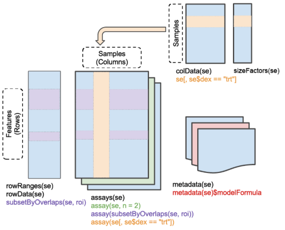

```{r setup, echo=FALSE, results="hide"}
suppressWarnings({
suppressMessages({
suppressPackageStartupMessages({
library(BiocStyle)
library(SummarizedExperiment)
library(BiocOncoTK) # uses restfulSE
library(restfulSE)
library(EnsDb.Hsapiens.v75)
library(openssl)
library(ggplot2)
library(rhdf5client)
})
})
})
```

```{r global_options, include=FALSE}
knitr::opts_chunk$set(fig.pos = 'h')
```

# Introduction

Analyses of multiomic archives like [The Cancer Genome Atlas (TCGA)](https://cancergenome.nih.gov/)
and single-cell transcriptomic experiments such as the 
[10x 1.3 million
mouse neuron dataset](https://support.10xgenomics.com/single-cell-gene-expression/datasets)
typically begin with downloads of large files and
conversion of file contents into formats based on local preferences.
In this paper we consider how targeted queries of large remote genomic
data resources can be conducted using methods available for
Bioconductor's `r Biocpkg("SummarizedExperiment")` class.
For large data archives that have been centralized
in cloud storage, use of this approach can help diminish effort
required to manage local storage,
and can facilitate interactive analysis of data
subsets in familiar programming idioms,
without downloading entire datasets.
Clients for
[HDF5](https://www.hdfgroup.org/)
or [Google BigQuery](https://cloud.google.com/bigquery)
are available in numerous languages; our
Bioconductor interface permits access to remote archives of genomic
data with familiar and semantically meaningful programmatic idioms,
while abstracting the remote interface from end users
and developers.


# Methods: Data structures and remote back ends

## The `SummarizedExperiment` class and related methods

Let $Q$ denote a matrix of quantifications arising from a genome
scale assay with $G$ assay features measured on $N$ experimental
samples.  The elements of $Q$ are the numbers $q_{ij}, i = 1, \ldots, G,
j = 1, \ldots, N$.  Bioconductor's SummarizedExperiment
structure
manages feature quantifications
with associated metadata about assay features
and samples.

In the 10x mouse neuron dataset, $G=27998$ and $N=1.3$ million.
Each of the $G$ features is a gene, and it is useful to
have handy a number of feature annotations like gene name,
location, functional role; suppose each gene has $F$ such
features recorded.
When these quantifications and
associated annotations are managed in a 
Bioconductor `SummarizedExperiment` `X`, the matrix $Q$ is programmatically bound to a $G \times F$
table of feature-level metadata
accessible by the `rowData` method, and to an $N \times R$ table of sample-level metadata accessible by `colData`,
where $R$ denotes the number of sample-level metadata
features recorded (@Huber2015).   See Figure \@ref(fig:seSchema).

```{r seSchema, out.width='60%', fig.cap = 'Schematic of SummarizedExperiment class structure.  Colored regions of panels within the schematic are linked with command examples in colored text beneath the panels.  For example, the purple command \\texttt{subsetByOverlaps(se, roi)} would produce a restricted \\texttt{RangedSummarizedExperiment} instance with features limited to those colored purple.  The \\texttt{sizeFactors} component is specific to a subclass for single cell data.',echo=FALSE}

```

In the context of R programming, let
`K` denote a vector of feature identifiers,
`S` denote a vector of sample identifiers.
The standard subsetting idiom `X[K,S]` expresses filtering of 
the all the information in $Q$ and the associated metadata
to features `K` and samples `S`.  A `GRanges`
instance (@Lawrence2013) defining genomic coordinates 
for features may be bound to `X`,
facilitating queries defined by genomic location (using, for example, `subsetByOverlaps`) to isolate features
coincident with or near the elements of a set of query genomic ranges (eg., binding peaks).  This outline of genomic data representation
and analysis is characteristic of Bioconductor.

## Examples of remote back ends

_Google BigQuery_. The Institute for Systems Biology Cancer
Genomics Cloud project (ISB-CGC) (@ISBCGC) uses 
Google BigQuery to provide access to
various public cancer genomics resources including
TCGA and the PanCancer Atlas (@Hoadley2018).
The `pancan_SE`
function of `r Biocpkg("restfulSE")` constructs queries that derive
`SummarizedExperiment` instances using quantifications and annotations
for PanCancer atlas experiments
managed in BigQuery tables.  


_HDF Scalable Data Service (HSDS)_.  An AWS S3-based
distributed data object model for
HDF5 datasets, including a
RESTful API to structure, populate, and query HDF5 archives, 
has been implemented by the HDF Group. 
A number of datasets of interest in bioinformatics
are served through [HDF Kita Lab](https://www.hdfgroup.org/solutions/hdf-kita/)
in the `/shared/bioconductor` folder.

## Lazy data retrieval via DelayedArray.

The \textit{restfulSE} package provides interfaces to 
BigQuery and HSDS so that 
the numerical content housed in these services
satisfies the API of the Bioconductor `r Biocpkg("DelayedArray")` 
(@Pages2018).
Any `DelayedArray` instance can serve as the `assay`
component of a `SummarizedExperiment` instance.  Thus the
capacities of `SummarizedExperiment` to bind semantically
rich metadata to genome-scale assays are extended implicitly to
data resources for which no standards exist for
associating substantive metadata.  

In conjunction with the `r Biocpkg("rhdf5client")` and 
`r CRANpkg("bigrquery")` packages,
\textit{restfulSE} functions translate filtering and selection operations
which are readily defined using `rowData`, `rowRanges`,
`colData` into formal queries resolvable by the HDF5 and
BigQuery services.  Numerical results are transmitted from
server to client only when needed.

# Results

The RESTful `SummarizedExperiment` representation
allows complicated research queries to be obtained in a concise,
fast, convenient and robust fashion, as illustrated by
the following examples.

## Hybrid data/annotation strategy for integrative analysis

The following code chunk, which generates
Figure \@ref(fig:pancanPanel), illustrates the 
use of the \textit{restfulSE} protocol
with the ISB-CGC BigQuery back end.  
```
library(SummarizedExperiment)
library(BiocOncoTK)       # uses restfulSE for cancer bioinformatics
bq = pancan_BQ()          # need CGC_BILLING to authenticate
seCOAD = buildPancanSE(bq, acronym="COAD", assay="RNASeqv2")
seCOAD = bindMSI(seCOAD)  # update to include MSIsensor scores
par(mfrow=c(1,2))         # figure layout 
amap = c("29126"="PD-L1", "925"="CD8A") # entrez:symbol mapping
bxs <- lapply( c("29126", "925"),       # for genes of interest
  function(x) boxplot(split(log2(as.numeric(assay( seCOAD[x,]))+1), 
      seCOAD$msiTest >= 4), names = c("<4", ">=4"), ylab=amap[x],
      xlab="MSIsensor score")
  )
```
Our interest is in replicating part of
Figure 5C
of @Bailey2018.  In that paper, it is shown that
microsatellite instability (MSI) is associated with
different expression signatures of immune cell infiltration
for adenocarcinomas of colon (COAD) and stomach (STAD), and
uterine corpus endometrial carcinoma (UCEC).
The MSI scores developed using MSIsensor are found
in Table S5 of @Ding2018.  These scores are not available
in BigQuery, but can be combined with the assay data
using standard R programming, leading to a hybrid
data/annotation strategy.

Functions in the `r Biocpkg("BiocOncoTK")` 
package (@bionc) build on
\textit{restfulSE} functionality to a) authenticate the
user to the BigQuery platform, b) select a tumor
type (COAD) and assay for `r Biocpkg("SummarizedExperiment")`
construction, c) bind Ding et al.'s MSI values as
sample-level data variable `msiTest`, d)
acquire and transform the PD-L1 and CD8A
(Entrez IDs 29126 and 925)
expression values, and e) form the stratified boxplot. 
The basic findings of Bailey et al. are replicated.
Enhancement of the code to produce a display covering
more genes and tumor types
is demonstrated in the BiocOncoTK package vignette.
Note that in this example, expression values are
only downloaded for the genes requested, without altering
the end user programming paradigm of working with
a SummarizedExperiment instance.

```{r pancanPanel, fig.height=3.5, fig.cap='Association of MSI sensor scores with distributions of PDL-1 and CD8A in TCGA colorectal adenocarcinoma samples (COAD).', echo=FALSE}
suppressMessages({
library(SummarizedExperiment)
library(BiocOncoTK)            # uses restfulSE
bq = pancan_BQ()               # need CGC_BILLING
seCOAD = bindMSI(buildPancanSE(bq, acronym="COAD", assay="RNASeqv2"))
par(mfrow=c(1,2)); amap = c("29126"="PD-L1", "925"="CD8A")
bxs <- lapply( c("29126", "925"),   # ENTREZIDs for genes of interest
  function(x) boxplot(split(log2(as.numeric(assay( seCOAD[x,]))+1), 
      seCOAD$msiTest >= 4), names = c("<4", ">=4"), ylab=amap[x],
      xlab="MSIsensor score")
  )
})
```


## HDF Scalable Data Service

Figure \@ref(fig:hdffig)
demonstrates use of a RESTful \texttt{SummarizedExperiment},
with assay data provided
in the object \texttt{/shared/bioconductor/darmgcls.h5}
at \texttt{hsdshdflab.hdfgroup.org}.  Briefly, as a
prelude to single-cell RNA-sequencing of glioblastoma (GBM)
tumors from four patients,
@Darmanis2017 used immunopanning to increase the
proportion of non-neoplastic cells that constitute
the "migrating front" of progression of glioblastoma.
Antibody to CD45 was used to capture microglial cells.
Figure \@ref(fig:hdffig) provides code to compare
the distribution of CD45 expression among the
classes of
cells as labeled in the metadata of GSE84465,
the NCBI GEO archive from which the quantifications
were derived.  In this example, data on one
gene from all cells
is retrieved when the statement defining vector \texttt{vals}
is executed.  The display can be recapitulated for
other genes by substituting different symbols in
the statement computing \texttt{ind}.
The \texttt{DelayedArray} framework leveraged here
enables basic computations of this kind without loading the
entire matrix into memory.

```{r hdffig, cache=TRUE, fig.height=3.5, fig.cap="Density estimates for log10 CD45 expression in single-cell RNA-seq studies of glioblastoma."}
library(rhdf5client)
library(SummarizedExperiment)
library(ggplot2)
cdar = BiocOncoTK::darmGBMcls
ind = match("PTPRC", rowData(cdar)$symbol)
var = gsub("selection: ", "", 
       cdar$characteristics_ch1.8)
vals = log10(assay(cdar[ind,])+1)
ddd = data.frame(log10norm=vals, pan=var)
ggplot(ddd, aes(x=log10norm, colour=pan)) + 
  geom_density() + ylim(0,1) + 
  xlab("log10 CD45+1")
```


# Performance

We focus on pursuit of reliability,
expressivity, and scalability using \textit{restfulSE}.  

**Reliability:**
The \textit{restfulSE}, \textit{rhdf5client}
and \textit{BiocOncoTK} packages are accompanied by detailed unit
tests that compare retrievals to known values.  In the
case of BigQuery table queries, the test
suite composes random queries 
in both BigQuery SQL and in the \texttt{SummarizedExperiment} 
idiom.  Results
are checked for elementwise equality.  

**Expressivity:** The code
segments for Figures \@ref(fig:pancanPanel) and \@ref(fig:hdffig) are
complex but easy to break down.  The joining and
reshaping of pancan-atlas tables in BigQuery corresponding
to the code in Figure \@ref(fig:pancanPanel)
can be checked through the query history in the BigQuery
interface.  The acquisition of expression values employed
five nested SELECT statements; the query for assay quantifications
was 6000 characters in length.
The R code is less than 500 characters including comments.

**Scalability.**  BigQuery is intrinsically auto-scaling,
but charges accrue with the amount of data scanned, 
so query design can have effects on throughput
and cost.  We rely on the \textit{bigrquery} (@bigr) 
and \textit{dbplyr} (@dbp) packages for
efficient translation of R-oriented data manipulations to 
BigQuery SQL.  Throughput with the HDF Scalable Data Service
is dependent upon the configuration of the object server,
the relationship of numerical data layout to prevalent access
patterns, and the degree to which queries capitalize on
API efficiencies like chunk-based retrieval.  For both
back ends, proper design and deployment of the querying client can
lead to throughput that scale with client-side resources.

# Conclusions

Cloud-scale storage and retrieval strategies are of significant
interest for genome science.
The \texttt{Summarized- Experiment} class
unifies assay data with substantive sample- and experiment-level
metadata, and its API for managing and interrogating
genome-scale experiment archives is used in numerous
analytic packages.
The \textit{restfulSE} package exposes high-performance
cloud-resident data stores to users and
algorithms as \texttt{Summarized- Experiment}s.  Continued improvements
in efficiency of
representation and query resolution for assay data and metadata
will help to achieve the potential of a federated data ecosystem for
enhanced discovery in biology through interactive genome-scale analysis.

# Acknowledgments 

Support for the development of this software was provided by NIH grants
U01 CA214846 (Carey, PI), U24 CA180996 (Morgan, PI) and
Chan Zuckerberg Initiative DAF 2018-183436 (Carey, PI).


